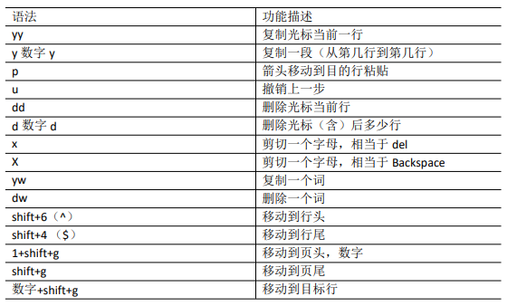
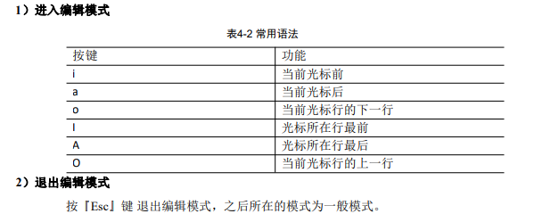
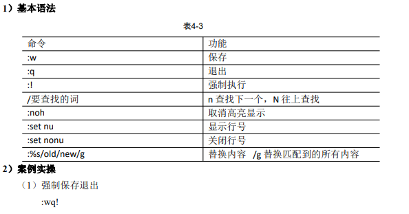
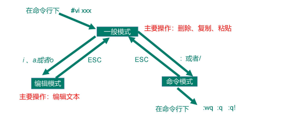

# VI/VIM编辑器

## 一般模式 

以 vi 打开一个档案就直接进入一般模式了（这是默认的模式）。在这个模式中， 你可 以使用『上下左右』按键来移动光标，你可以使用『删除字符』或『删除整行』来处理档 案内容， 也可以使用『复制、粘贴』来处理你的文件数据。 

  

## 编辑模式 

在一般模式中可以进行删除、复制、粘贴等的动作，但是却无法编辑文件内容的！要 等到你按下『i, I, o, O, a, A』等任何一个字母之后才会进入编辑模式。 注意了！通常在Linux中，按下这些按键时，在画面的左下方会出现『INSERT或 REPLACE』的字样，此时才可以进行编辑。而如果要回到一般模式时， 则必须要按下 『Esc』这个按键即可退出编辑模式。 

##  指令模式 

​	在一般模式当中，输入『 : / ?』3个中的任何一个按钮，就可以将光标移动到最底下那 一行。 

​	在这个模式当中， 可以提供你『搜寻资料』的动作，而读取、存盘、大量取代字符、 离开 vi 、显示行号等动作是在此模式中达成的！ 

##  模式间转换 

